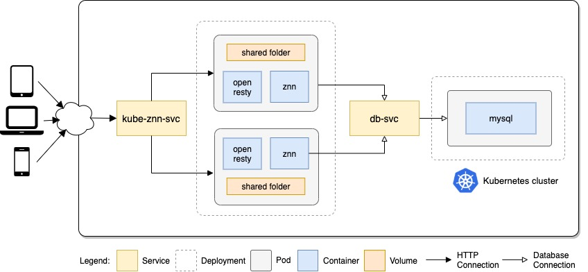

# Kube-znn 

Kube-ZNN is a deployment of the tradicional znn exemplar system for Kubernetes. 

## Getting started

Make sure you have access to a running Kubernetes cluster and the `kubectl` on your `PATH`. 

Just run `kubectl apply -f .` in this folder and open [http://localhost:8080/news.php](http://localhost:8080/news.php) in your browser.

## Architecture

### Containers

**ZNN**

**OpenResty**

**MySQL**

### Prometheus integration

The web applications served by a traditional LEMP stack (Linux, NGINX, MySQL, PHP) does not 
work well when the developers want to use  Prometheus to monitor performance metrics. The 
reason for this is that a PHP  application typically does not track metrics like the amount 
of processed requests or the average request time (or would need to gather this data by 
itself and then persist it in a database).

### Pages

* **news.php** It's the same as its original version, just a few improvements on html structure.
* **liveness.php**
* **readiness.php**
